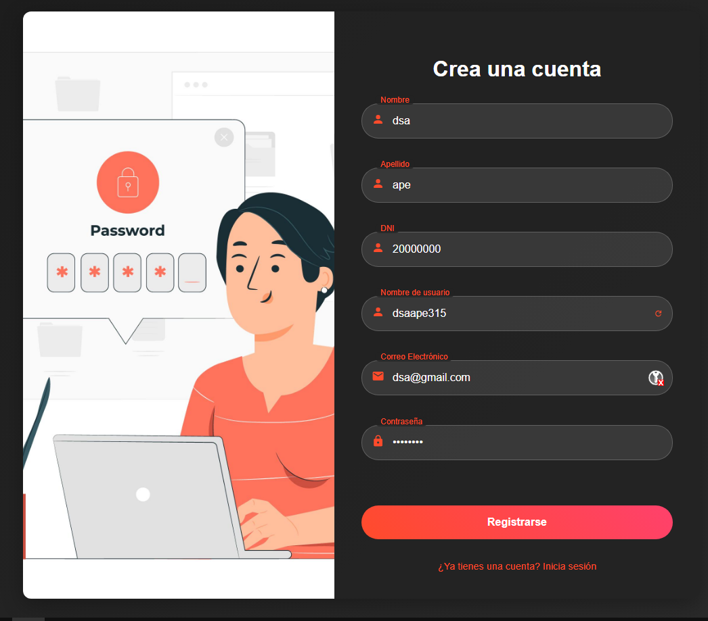
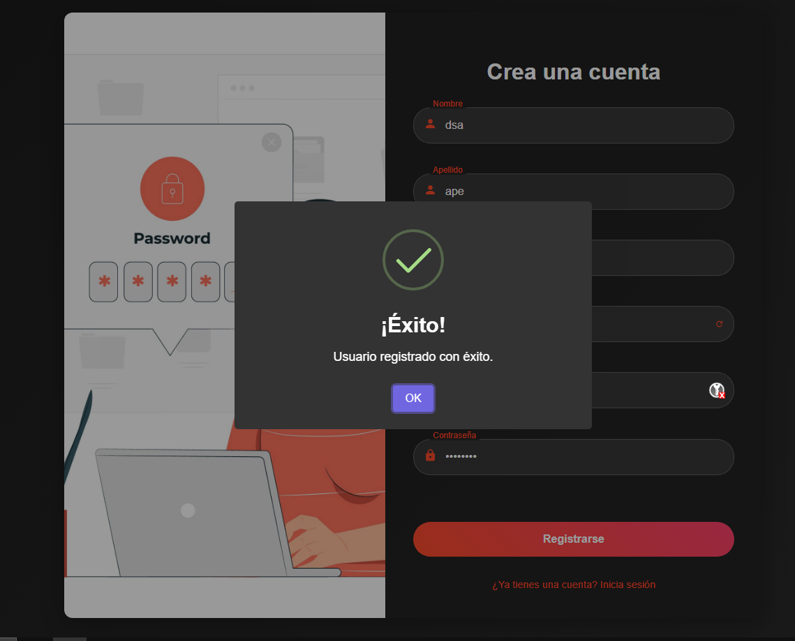
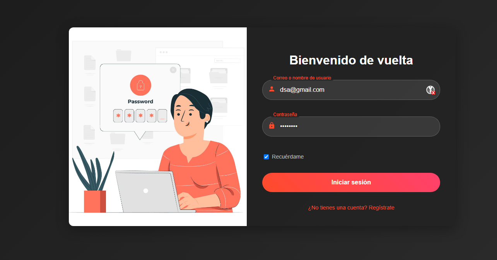
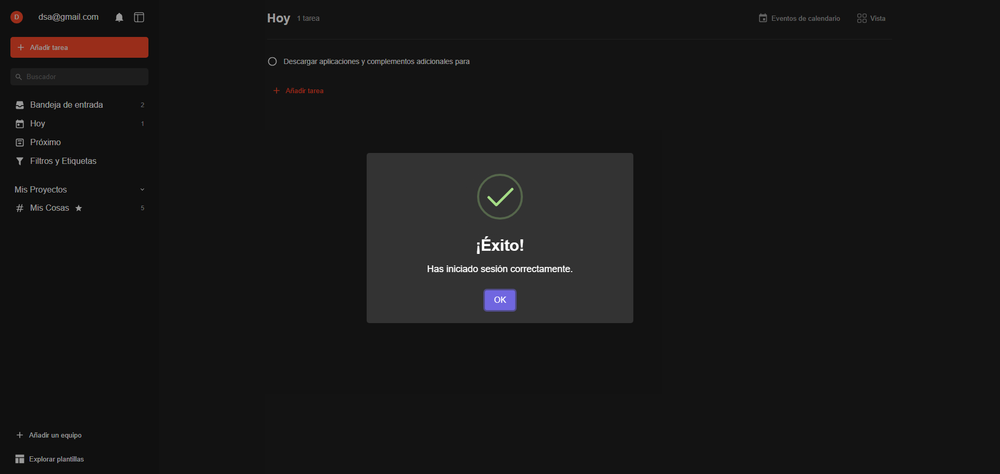
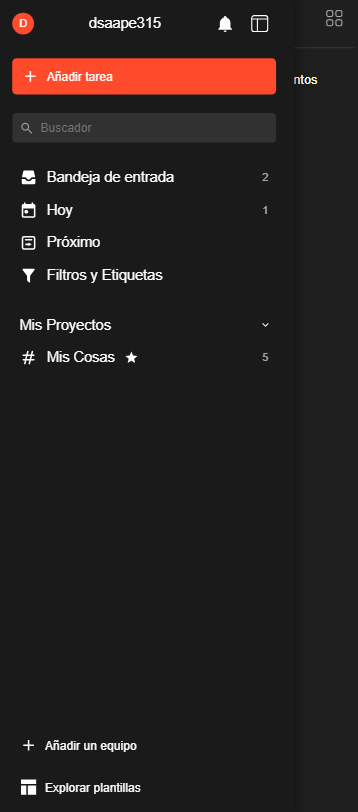
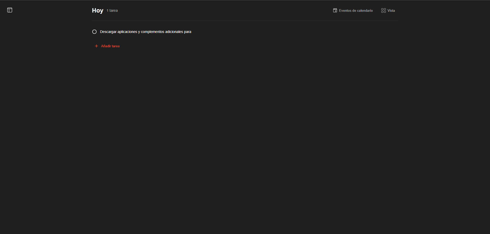

# TodoListPeruvian

¡Bienvenido al proyecto **TodoListPeruvian**! Este es un proyecto de gestión de tareas realizado con **Node.js**, **React**, y **Vite**, enfocado en la usabilidad y la conectividad con una API backend. El objetivo principal es proporcionar a los usuarios una aplicación para gestionar y organizar sus tareas diarias de forma fácil y eficiente.

## Índice

- [Descripción del Proyecto](#descripción-del-proyecto)
- [Tecnologías Utilizadas](#tecnologías-utilizadas)
- [Estructura del Proyecto](#estructura-del-proyecto)
- [Instalación y Ejecución](#instalación-y-ejecución)
- [Uso](#uso)
- [Contribuyentes](#contribuyentes)
- [API y Autenticación](#api-y-autenticación)
- [Licencia](#licencia)
- [Imágenes y Videos](#imágenes-y-videos)

## Descripción del Proyecto

**TodoListPeruvian** es una aplicación web que permite a los usuarios registrarse, iniciar sesión y gestionar sus tareas diarias. La aplicación está desarrollada utilizando **React** con **Vite** como bundler, cuenta con validaciones en el frontend y se integra con una API backend para gestionar usuarios y sus tareas.

## Tecnologías Utilizadas

Este proyecto utiliza las siguientes tecnologías y herramientas:

- **Node.js (v20):** Entorno de ejecución para JavaScript.
- **React:** Biblioteca de JavaScript para construir interfaces de usuario.
- **Vite:** Herramienta de construcción rápida para proyectos en React.
- **Axios:** Para realizar peticiones HTTP a la API.
- **TypeScript:** Para tipado estático en JavaScript y mejorar la calidad del código.
- **CSS:** Para el estilo y diseño de la interfaz de usuario.
- **Git:** Sistema de control de versiones distribuido utilizado para gestionar el código fuente del proyecto.
- **GitHub:** Plataforma para alojar el código fuente del proyecto y facilitar la colaboración entre desarrolladores.
- **ESLint:** Herramienta de análisis estático de código para identificar y reportar patrones en JavaScript, ayudando a mantener la calidad del código.
- **Prettier:** Herramienta de formateo de código para asegurar un estilo de código consistente.
- **Formik:** Biblioteca para manejar formularios en React de forma sencilla.
- **SweetAlert2:** Librería para mostrar alertas personalizadas en la interfaz de usuario.
- **React Router:** Para gestionar la navegación entre las diferentes páginas de la aplicación.
- **React Icons:** Biblioteca de iconos para React que se utiliza para añadir iconos en la interfaz de usuario.

## Estructura del Proyecto

La estructura del proyecto incluye los siguientes directorios principales:

```
└── 📁pid_20246__miercoles_grupo_02_parte2
    └── 📁public
        └── 📁img
            └── 📁README
                └── 1.png
                └── 2.png
                └── 3.png
                └── 4.png
                └── 5.png
                └── 6.png
        └── vite.svg
    └── 📁src
        └── 📁api
            └── 📁auth
                └── authApi.ts
        └── 📁assets
            └── 📁img
                └── 📁auth
                    └── authFormImg.jpg
                └── 📁errors
                    └── error404.png
                └── 📁icons
                    └── icon-logo.webp
            └── react.svg
        └── 📁components
            └── 📁common
                └── InputGroup.tsx
                └── Sidebar.tsx
            └── 📁icons
                └── 📁auth
                    └── FaEnvelope.tsx
                    └── FaLock.tsx
                    └── FaRandom.tsx
                    └── FaUser.tsx
                    └── index.ts
                └── 📁dashboard
                    └── CalendarIcon.tsx
                    └── CircleIcon.tsx
                    └── index.ts
                    └── PlusIcon.tsx
                    └── ViewIcon.tsx
                └── 📁sidebar
                    └── ArrowIcon.tsx
                    └── BellIcon.tsx
                    └── FiltersIcon.tsx
                    └── HashIcon.tsx
                    └── InboxIcon.tsx
                    └── index.ts
                    └── MenuIcon.tsx
                    └── NextIcon.tsx
                    └── PlusIcon.tsx
                    └── SearchIcon.tsx
                    └── StarIcon.tsx
                    └── TemplateIcon.tsx
                    └── TodayIcon.tsx
                └── AccessTime.tsx
                └── AchievementIcon.tsx
                └── AddIcon.tsx
                └── AttachMoney.tsx
                └── Build.tsx
                └── Category.tsx
                └── ChevronLeft.tsx
                └── ChevronRight.tsx
                └── CloseIcon.tsx
                └── CodiconAccount.tsx
                └── EmailIcon.tsx
                └── Event.tsx
                └── FacebookIcon.tsx
                └── GamepadIcon.tsx
                └── GithubIcon.tsx
                └── GoogleIcon.tsx
                └── HashtagIcon.tsx
                └── Help.tsx
                └── InputGroup.tsx
                └── InstagramIcon.tsx
                └── Inventory.tsx
                └── LocationIcon.tsx
                └── MultiplayerIcon.tsx
                └── PhoneIcon.tsx
                └── PlayIcon.tsx
                └── Premium.tsx
                └── Shoppingcart.tsx
                └── SportsEsports.tsx
                └── Star.tsx
                └── StarIcon.tsx
                └── ThumbsUpIcon.tsx
                └── TikTokIcon.tsx
                └── TimeIcon.tsx
            └── 📁layout
                └── Layout.tsx
        └── 📁pages
            └── 📁auth
                └── Login.tsx
                └── Register.tsx
            └── 📁dashboard
                └── Home.tsx
            └── 📁errors
                └── Error404.tsx
        └── 📁services
            └── 📁auth
                └── authHelpers.ts
                └── authService.ts
        └── 📁styles
            └── 📁auth
                └── AuthForm.css
            └── 📁common
                └── Sidebar.css
            └── 📁dashboard
                └── Home.css
            └── 📁errors
                └── Error404.css
            └── 📁layout
                └── Layout.css
        └── 📁types
            └── User.ts
        └── App.tsx
        └── main.tsx
        └── vite-env.d.ts
    └── .gitignore
    └── eslint.config.js
    └── index.html
    └── package-lock.json
    └── package.json
    └── README.md
    └── tsconfig.app.json
    └── tsconfig.json
    └── tsconfig.node.json
    └── vite.config.ts

```

## Instalación y Ejecución

Para comenzar a trabajar con TodoListPeruvian, sigue estos pasos:

### 1. Clonar el repositorio

Puedes clonar el proyecto en tu máquina local usando el siguiente comando:

```bash
git clone https://github.com/jorgejacinto9701/pid_20246__miercoles_grupo_02_parte2
```

### 2. Instalar Dependencias

Navega al directorio del proyecto y ejecuta el siguiente comando para instalar todas las dependencias:

```bash
npm install
```

### 3. Ejecutar el Proyecto

Para iniciar el servidor de desarrollo y ver el proyecto en acción, usa:

```
npm run dev
```

Esto levantará la aplicación en modo de desarrollo, y podrás acceder a ella en

```bash
 http://localhost:5173
```

(por defecto).

## Uso

La aplicación permite gestionar tareas. Los usuarios pueden:

Iniciar sesión: Usando su correo o nombre de usuario y contraseña.
Registrar una nueva cuenta: Completar el formulario con los datos del usuario (nombre, apellido, email, username, contraseña).
Ver el Dashboard: Una vez logueado, el usuario podrá acceder a su página principal donde podrá ver y gestionar sus tareas.

## Contribuyentes

```bash
Claudia Yhadira Sifuentes Zevallos (Desarrollador principal) ("H" de humo)
Eduardo Miguel Jaime Gomero  (Desarrollador principal)
```

## API y Autenticación

Este proyecto se conecta con una API para la autenticación de usuarios. Aquí te mostramos cómo se estructura la API y los tipos de datos que se envían:

```bash
import axios from "axios";
import { User } from "../../types/User";

// URL base para tu API
const apiUrl = "https://proyecto-backend2-production.up.railway.app/api/user";

// Función para Login
export const login = async (loginRequest: {
  email: string | null;
  username: string | null;
  password: string;
}) => {
  try {
    const response = await axios.post(`${apiUrl}/login`, loginRequest);
    return response;
  } catch (error) {
    throw error;
  }
};

// Función para registrar un nuevo usuario
export const register = async (userData: User) => {
  // interfaz User
  try {
    const response = await axios.post(`${apiUrl}/register`, userData);
    return response;
  } catch (error) {
    throw error;
  }
};
```

Ejemplo de datos para registro:

```bash
{
  "nombre": "Señor Jesús",
  "apellido": "Salazar Lazo",
  "dni": "12345678",
  "username": "SierraTorres",
  "email": "myd@gmail.com",
  "password": "lechuga123"
}
```

## Licencia

Este proyecto está bajo la Licencia MIT. Puedes usar, modificar y distribuir el código con fines personales o comerciales.

## Imágenes y Videos

### Imágenes:

A continuación, se muestran algunas imágenes del formulario de autenticación (AuthForm) y otras vistas relevantes:

1. 
2. 
3. 
4. 
5. 
6. 

Videos:
Demo del Proyecto:
Cómo ejecutar el Proyecto:

```

```
